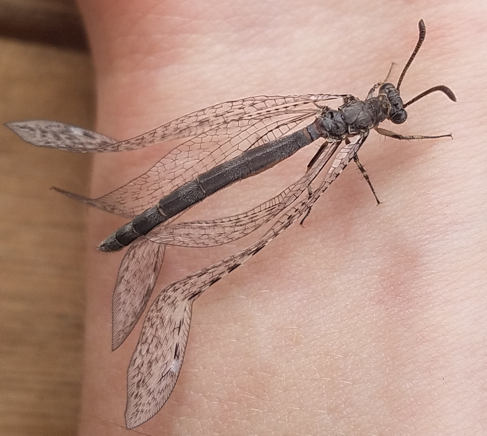

# Marvin the antlion

The antlion, cousin of the lacewing, is a strange little pit-digging insect.
In their adult forms, they're among Mother Nature's great works of art: 

<p><a href="https://commons.wikimedia.org/wiki/File:Crisopid_July_2013-9a.jpg#/media/File:Crisopid_July_2013-9a.jpg"></a><br>By <a href="//commons.wikimedia.org/wiki/User:Alvesgaspar" title="User:Alvesgaspar">Alvesgaspar</a> - <span class="int-own-work" lang="en">Own work</span>, <a href="https://creativecommons.org/licenses/by-sa/4.0" title="Creative Commons Attribution-Share Alike 4.0">CC BY-SA 4.0</a>, <a href="https://commons.wikimedia.org/w/index.php?curid=40939372">Link</a></p>

<p><a href="https://commons.wikimedia.org/wiki/File:Antlion_(Myrmecaelurus_trigammus)_Macedonia.jpg#/media/File:Antlion_(Myrmecaelurus_trigammus)_Macedonia.jpg"></a><br>By <a href="https://www.wikidata.org/wiki/Q54800218" class="extiw" title="d:Q54800218"><span title="Scottish wildlife photographer">Charles J. Sharp</span></a> - <span class="int-own-work" lang="en">Own work</span>, from <a rel="nofollow" class="external text" href="https://www.sharpphotography.co.uk/">Sharp Photography, sharpphotography.co.uk</a>, <a href="https://creativecommons.org/licenses/by-sa/4.0" title="Creative Commons Attribution-Share Alike 4.0">CC BY-SA 4.0</a>, <a href="https://commons.wikimedia.org/w/index.php?curid=105132986">Link</a></p>

Adult lacewings are a fairly common (but by no means unwelcome!) sight in North Carolina,
fluttering delicately on an evening breeze.  However, to stumble over the lacewing
in its larval form takes, in my experience, a much more keen eye.  The larvae are
fierce predators, some of whom have an interesting habit of carrying shields on their
backs made of lint, detritus, and whatever else they can get their grubby little mitts on.
I, by accident, encountered a fine specimen on an NC Oak tree.  I took a video where
you can sort of make out its legs and mandibles when it's flipped over:

<iframe width="600" height="337" src="https://www.youtube.com/embed/sm72p--BG3c" title="YouTube video player" frameborder="0" allow="accelerometer; autoplay; clipboard-write; encrypted-media; gyroscope; picture-in-picture" allowfullscreen></iframe>

In a funny twist of symmetry, the situation is much the reverse for the antlion:
common larvae and rare adults.  The larvae are known for digging conical pits
in the sand and buring themselves at the bottom, waiting for an unsuspecting
ant to fall in.  The ant tumbles to the bottom, where the waiting antlion snaps
its jaws shut on it and drags it below the surface.  If it were scaled up by a
few orders of magnitude, the antlion would be something like a
[sarlacc](https://starwars.fandom.com/wiki/Sarlacc).  Luckily the antlion is small,
and so it is cute.  The antlion is in the family Myrmeleontidae, which (as with many
names in taxonomy) is fun if you know a bit of Greek and Latin: myrmex
(ant, as in myrmecology, the study of ants) + leo (as in lion).

```{eval-rst}
.. sidebar:: Note

  Not all antlions digs pits.  But the ones I'm talking about today do.
```

The antlion digs its pit so that the cone's wall is at the sand's angle of repose, meaning
even if the ant manages to recover from the initial tumble, the walls of the pit
collapse beneath it as it tries to climb out.  And to make matters trickier, the antlion induces landslides
by flinging up sand from the bottom (that's how it digs the pit too),
creating small avalanches to carry the ant back to the bottom.  Ants are a common
prey item, although I can personally attest that the antlion will happily take
other insects as well.  The antlion immobilizes the prey by dragging
it under the surface and injecting it with a nasty cocktail that both paralyzes
the prey and dissolves it from the inside.  Then the antlion slurps out the goodies
and flings the empty husk out of the pit.  Gross!

Anyway, I've got several dozen larvae living in the soil under my roof overhang and 
I brought a few of them inside as pets.
The soil here is relatively sandy by nature, but I
wanted to put them up in style, so I separated out the fine particulate from
the coarse using a small sieve.  A coffee can works well as a home; not only is
it both deep and wide enough to accommodate a large antlion pit with room to spare,
but the rim around the top has proven too challenging an obstacle for an ant with
a mind to escape its grim fate.  I used cans from "Chock full o'Nuts", who,
bewilderingly, spurned my offer to let them sponsor this blog post (not really).

Marvin was the first antlion to come inside.  I don't know Marvin's sex.  Maybe
there's a way to tell, but that sort of knowledge isn't shared with 
fake entomologists like me.  Marvin was a good roommate: never hosted loud parties,
never left dishes in the sink.  You'd hardly know Marvin was even living here.
I gave Marvin an ant a day, sometimes two, sometimes none if I forgot.  Antlions
can go weeks or months without a meal, so Marvin was living high on the hog.  It
went on that way for a month or two, and I noticed Marvin's pit gradually getting wider
and deeper over time.  An interesting tidbit about antlion larvae is that they
don't have a mechanism to excrete waste, so their metabolic products just accumulate
until they pupate and turn into adults.

One day I noticed Marvin showing a distinct lack of interest in the ant I had
offered.  I suspected the big day had finally come, so I dug up the pit bottom
and found a lovely spherical coccoon, with Marvin presumably inside it.  I
rehoused Marvin to a pickle jar to free up the coffee can for a new tenant.
At that point I brought in Lisa and Boris, about whom I may write a future post.

Some weeks passed and eventually I woke up one morning to find Marvin perched on
top of the empty coccoon.  Freshly-eclosed adults often are "soft" and need some
time to harden up, so I let well enough alone for a while.  No need to rush things.
Here is Marvin as a proper adult antlion, able to drink and eligible for the draft:



Marvin's wings were still straightening out after being rolled up inside the
coccoon.  I left Marvin on a juniper bush in my backyard; I confess I did not
not allow myself to witness the final departure for fear of tearing up.
I haven't seen Marvin since then.  I hope the world is being kind to my little friend.
